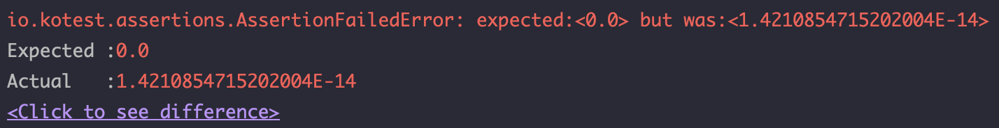
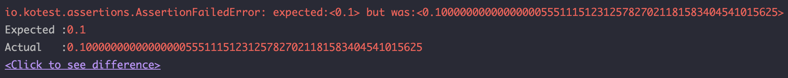
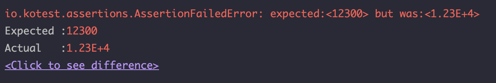
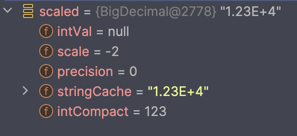

개발을 하다 보면 소수를 나타내거나 소수를 가지고 연산을 해야 하는 경우가 많습니다. 별 반 개 단위로 나타낼 수 있는 별점을 나타내거나, 정수로 나타낸 점수지만 평균을 구하거나... 정말 많은 곳에 소수를 사용해야 합니다. 그렇기 때문에 우리는 소수를 나타내는 데이터 타입과 친숙할 수 밖에 없는데요. 특히나 금전 관련되어서는 더 많은 사용처가 존재합니다. 결제할 때 정산하는 카드 수수료, 예금 혹은 적금의 금리, 이자 수익에 대한 세금 계산, 주식의 수익률 계산... 모두 소수 계산을 필요로 합니다. 때문에 금융권 도메인을 개발하거나, 비금융권 도메인이더라도 결제 등 금원과 관련된 도메인을 다루는 개발자라면 더더욱 소수 및 소수점 계산과 친숙할 수 밖에 없습니다.

이런 숫자 및 계산들을 나타내기 위해 프로그래밍 언어들은 소수 타입을 지원하는데요, 코틀린을 기준으로 설명드리면 가장 많이 사용하는 소수 타입은 Double 타입이며 가끔 Float 타입을 사용하는 경우도 있습니다. 하지만 많은 분들이 아시다시피 Double이나 Float 타입은 부동 소수점 연산에 의한 오차 문제를 가지고 있습니다. 간단한 예제로 확인해보겠습니다.

```kotlin
data class UsDollarAccount(
    var balance: Double = 0.0,
) {
    fun deposit(amount: Double) {
        balance += amount
    }

    fun withdraw(amount: Double) {
        balance -= amount
    }
}
```

많은 분들이 아시다시피 미국 달러화의 경우 달러 + 센트 조합으로 소수점 아래 둘째자리까지 나타낼 수 있습니다. 저는 이런 달러화를 예치하고 출금할 수 있는 UsDollarAccount 라는 간단한 클래스를 만들었습니다. 그리고, 총 10번, 9.9달러씩을 예치한다고 하겠습니다.

그리고 10번 예치한 금액을 모두 빼서 통장의 잔고를 0달러로 만들고 싶은 니즈가 생겼습니다. 저는 얼마를 출금하면 될까요? 9.9 달러씩 10번 넣었으니 99달러일 것입니다. (이자는 계산하지 않겠습니다.) 그래서 99달러를 빼면, balance의 값은 다시 0.0이 되겠죠? 이것을 테스트 코드로 나타내보겠습니다.

```kotlin
class UsDollarAccountTest {
    @Test
    fun `9달러 90센트를 10번 입금하고 99달러를 출금하면 0달러의 잔고가 남아있다`() {
        val account = UsDollarAccount()
        repeat(10) { account.deposit(9.9) }
        account.withdraw(99.0)

        account.balance shouldBe 0.0
    }
}
```

결과는 어떨까요? 테스트는 실패합니다.



1.421...에 E-14... 대충 소수점 아래 매우 작은 숫자가 남아있다는 오류가 나왔습니다. 그렇습니다. 조금 전에 말했듯이 부동 소수점 방식의 오차로 인해 남아있는 값입니다. 부동 소수점 연산은 이진수로 소수를 나타내야하는 한계 때문에 실제 값에 가깝게 근사할 수 있을 뿐 정확히 나타내지 못하는 소수값들이 있기 때문이죠.

작은 오차가 크게 중요하지 않은 도메인이라면 괜찮지만 금원과 관련된 도메인은 이런 작은 오차로도 문제가 생길 소지가 다분한데요, 그래서 금융권과 같이 금원을 다루는 곳에서는 정교한 소수 연산을 해야할 때 BigDecimal 타입을 사용하곤 합니다. Int, Long, Double, Float을 사용한 연산에 비해 조금 느리지만, 보다 정교한 값을 계산해낼 수 있기 때문이죠. 저 역시 인터넷은행에서 일하고 있는 개발자로서 BigDecimal을 활용해 개발을 하는 경험을 가질 수 있었는데요. 저희 회사는 특히나 코틀린을 사용하다 보니 기존에 자바로 BigDecimal을 다루는 것과 비슷하면서도 조금 더 편리하게 사용할 수 있는 부분들이 있었습니다. 오늘은 이를 바탕으로 코틀린에서 BigDecimal을 실수 없으면서도 편리하게 사용하는 방법을 알아보도록 하겠습니다.

## BigDecimal은 어떻게 생겼을까

### BigDecimal의 멤버 변수

BigDecimal은 자바의 타입이므로, 기본적으로 Reference Type이며 불변으로 설계되어 있는 클래스입니다. 내부 값을 변경시킬 수 없고 변경시킬 경우 기존 객체의 값이 변하는 것이 아니라 값이 변경된 새로운 객체를 생성해내게 됩니다. 우선은 BigDecimal의 구조부터 알아보고 가는게 좋겠는데요, 코틀린을 내려놓고 잠시 자바 코드로 돌아가보도록 하겠습니다.

```java
public class BigDecimal extends Number implements Comparable<BigDecimal> {
    private final BigInteger intVal;
    private final int scale;
    private transient int precision;
    private final transient long intCompact;
    ...
}
```

우선 멤버 변수부터 알아봅시다. 먼저 intVal은 unscaled 값입니다. 보시면 BigInteger 타입임을 알 수 있는데요, BigInteger는 int와 long이 표현할 수 있는 값보다 훨씬 더 큰 범위의 숫자를 표현할 수 있습니다. 이를 통해 우리는 부가적으로 BigDecimal도 큰 범위의 숫자를 다룰 수 있다는 것을 알 수 있겠네요. 제가 intVal은 unscaled 값이라고 말했죠? 이는 소수 사이즈를 정하지 않은, 한마디로 정수부와 소수부를 나누지 않고 숫자를 죽 늘어놓은 값이라고 생각하면 될 것 같습니다. 예를 들어 `123.45` 라면 intVal은 12345 인 것이죠. 그런데 long 타입으로 선언된 intCompact가 보이시나요? 만약 값이 충분히 작아서 long의 표현 범위 안이라면 reference 타입인 intVal 대신 primitive 타입인 intCompact에 저장해서 메모리를 아낀다(주석에서는 이 부분을 컴팩트하게 저장한다고 표현하고 있습니다)고 하네요.

scale과 precision은 자릿수를 나타내기 위한 값입니다. 단순이 직역하면 scale은 규모, precision은 정밀도를 나타내는데요, scale은 소수부의 규모를 나타내고 precision은 전체 숫자의 정밀도를 나타낸다고 생각하시면 쉬울 것 같습니다. 더욱 쉽게 표현하자면, scale은 소수점 아래에 몇 자리가 있는지이고, precision은 전체 숫자의 자리수가 몇 자리인지, 다시 말하자면 몇 개의 숫자가 존재하는지를 나타내는 값입니다. 예를 들어 `123.45` 라면 소수점 아래 두 자리가 있으므로 scale은 2, 전체 자리수는 총 5자리이므로 precision 값은 5인 것이죠.

### BigDecimal을 생성하는 방법

BigDecimal은 여러 개의 생성자를 가지고 있습니다. 자바의 숫자 타입이 여러 가지가 있기 때문에 당연한 것일까요? int, long, double, float 값을 인자로 받는 생성자들을 가지고 있고, 추가적으로 String 타입을 받는 생성자도 가지고 있습니다. 여기서 주의해야 할 점은, **double, float을 받는 생성자는 절대 사용하지 말 것** 입니다. 앞서 double, float 타입에는 부동소수점 계산으로 인한 오차가 있다고 말했었죠? 문제는 생성자 인자로 double이나 float 타입이 들어가면 이 부동소수점 오차가 그대로 값으로 들어간다는 점입니다. 즉, `BigDecimal(0.1)` 은 0.1이 아니라 0.100000000000000005... 라는 것입니다. 
```kotlin
@Test
fun `BigDecimal 테스트`() {
    BigDecimal(0.1) shouldBe BigDecimal("0.1")
}
```


이렇게 생성부터 잘못된 값이 들어간다면 아무리 정확한 연산을 한다고 해도 결과의 정확도를 보장할 수 없게 됩니다. 이 문제는 String 타입으로 만들어주면 해결이 됩니다. `BigDecimal(0.1)` 은 0.100000000000000005... 지만, `BigDecimal("0.1")`은 0.1입니다. 따라서 소수를 BigDecimal로 만들 때 생성자를 사용할 것이라면 toString을 활용하든, 그냥 문자열 리터럴을 사용하든 String 타입으로 만들어서 인자로 전달해주는 것이 좋습니다.

생성자 외에도 BigDecimal을 만들 수 있는 방법이 존재합니다. BigDecimal은 valueOf라는 정적 팩토리 메서드를 제공하는데요, long을 인자로 받는 메서드와 double을 인자로 받는 메서드를 제공합니다.

```java
public static BigDecimal valueOf(long val) {
    if (val >= 0 && val < ZERO_THROUGH_TEN.length)
        return ZERO_THROUGH_TEN[(int)val];
    else if (val != INFLATED)
        return new BigDecimal(null, val, 0, 0);
    return new BigDecimal(INFLATED_BIGINT, val, 0, 0);
}

public static BigDecimal valueOf(double val) {
    // Reminder: a zero double returns '0.0', so we cannot fastpath
    // to use the constant ZERO.  This might be important enough to
    // justify a factory approach, a cache, or a few private
    // constants, later.
    return new BigDecimal(Double.toString(val));
}
```

여기서 우리는 두 가지 특징을 확인할 수 있습니다. long을 인자로 받는 valueOf의 주 목적은 0 ~ 10 사이의 숫자에 대한 캐싱입니다. 그리고 `BigDecimal(long val)` 보다 권장되는 객체 생성 방식이기도 합니다.

> This static factory method is provided in preference to a (long) constructor because it allows for reuse of frequently used BigDecimal values

`BigDecimal.valueOf(long val)` 에는 위와 같은 주석이 붙어 있는데요, 해석하자면 자주 사용되는 BigDecimal 값들을 캐싱하기 때문에 생성자보다 우선적으로 제공된다는 이야기입니다.

double 값을 인자로 받는 valueOf는 long처럼 캐싱된 값을 반환하는 기능은 없습니다. 대신, 기존 `BigDecimal(double val)`이 가지고 있는, 부동소수점 오차가 그대로 BigDecimal에 반영된다는 문제점을 해결할 수 있는데요, 내부에서 `Double.toString(val)`을 호출하기 때문입니다. Double.toString의 경우 내부에서 `FloatingDecimal.toJavaFormatString`을 호출하게 되는데, 이 과정에서 부동소수점 오차를 제거한 문자열을 반환하게 됩니다. 즉, `Double.toString(0.1)`을 호출하게 되면 부동소수점 오차가 사라진 `"0.1"`을 반환하게 되는 것입니다. 그리고 그 문자열을 인자로 하여 생성자를 호출하기 때문에 오차가 없는 정확한 소수 값을 생성할 수 있습니다.

정리하자면, BigDecimal 생성은 다음 케이스를 사용하는 것이 좋습니다.

- 정수 타입일 경우 BigDecimal.valueOf 를 사용
- 소수 타입일 경우 BigDecimal.valueOf 를 사용하거나, 문자열 리터럴을 사용하여 생성자를 호출

결국 일반적으로는 정적 팩토리 메서드를 사용하여 생성하는 것이 좋다는 이야기인데, 예외 상황도 있습니다. 소수점 아래 자리수를 나타내고 싶을 때 입니다. 예를 들어 소수점 둘째 자리까지 무조건 나타내고 싶어서 `BigDecimal.valueOf(1.00)`을 호출해봐야 실제 값은 1.0으로 들어가게 됩니다. 이런 경우에는 생성 후 소수점 세팅을 해주거나, `new BigDecimal("1.00")`으로 문자열 리터럴을 사용해주는게 좋습니다.

> 개인적인 이야기  
> 
> 저는 개인적으로 이렇게 생성자와 valueOf가 모두 열려있고, 심지어 생성자 중 하나는 오차를 만들어내는 BigDecimal의 방식을 굉장히 싫어합니다. 정적 팩토리 메서드와 생성자가 모두 열려 있어서 어떤 것을 호출해야 할 지 헷갈리게 되죠. 게다가 일반적으로 처음 보는 객체를 생성하려 하면 생성자를 호출하기 마련인데, BigDecimal에서 권장하는 생성 방식은 정적 팩토리 메서드입니다. valueOf만 열려 있든지, 오차가 있는 생성자에는 Deprecated 처리를 하든지 하는 것이 어땠을까 하는 아쉬움이 있습니다.

### BigDecimal 소수점

자 이제 BigDecimal의 소수점 이야기로 넘어가보겠습니다. 앞서 scale 필드를 통해 BigDecimal이 소수점을 나타낸다고 했었는데요, 여기서 우리는 `setScale` 메서드가 소수점을 다루는 메서드라는 것을 알 수 있습니다.

```java
public BigDecimal setScale(int newScale) {
    return setScale(newScale, ROUND_UNNECESSARY);
}

public BigDecimal setScale(int newScale, RoundingMode roundingMode) {
    return setScale(newScale, roundingMode.oldMode);
}
```

위 두 메서드 중 1번 메서드는 다시 2번 메서드를 호출하고, 2번 메서드는 자바 9 버전부터 deprecated된 `setScale(int newScale, int roundingMode)` 메서드를 호출합니다. 상세 구현은 해당 메서드에 되어 있는데, roundingMode를 int에서 enum을 사용하라고 deprecated된 것으로 보입니다.

roundingMode를 지정하지 않으면 RoundingMode.ROUND_UNNECESSARY로 지정되고, 직접 지정할 수도 있습니다. enum 및 파라미터 이름에서 알 수 있듯이 반올림을 하는 방법을 결정하는 인자입니다.

```java
public enum RoundingMode {
    // 양수 올림, 음수 내림
    UP(BigDecimal.ROUND_UP),
    
    // 양수 내림, 음수 올림
    DOWN(BigDecimal.ROUND_DOWN),
    
    // 무조건 올림
    CEILING(BigDecimal.ROUND_CEILING),
    
    // 무조건 내림
    FLOOR(BigDecimal.ROUND_FLOOR),
    
    // 사사오입 반올림 - 4 이하(5 미만)면 내리고 5 이상이면 올림
    HALF_UP(BigDecimal.ROUND_HALF_UP),
    
    // 오사육입 반올림 - 5 이하면 내리고 6 이상(5 초과)이면 올림
    HALF_DOWN(BigDecimal.ROUND_HALF_DOWN),

    // 오사오입 (Banker's Rounding)
    // 기본적으로는 5 초과면 올리고 5 미만이면 내림
    // 5일 경우, 앞자리 숫자가 짝수면 내리고 홀수면 올림 - 즉, 앞자리 숫자가 짝수가 되도록
    HALF_EVEN(BigDecimal.ROUND_HALF_EVEN),
    
    // 소수점 처리를 하지 않아 연산 결과가 소수라면 ArithmeticException
    UNNECESSARY(BigDecimal.ROUND_UNNECESSARY);
    
    ...
}
```

인자가 newScale만 있는 setScale 메서드의 경우 roundingMode를 UNNECESSARY로 지정하고 있는데요, 이 때 소수점 처리를 해야 하는 상황이면 ArithmeticException이 발생합니다. 따라서 새로 지정하는 scale이 기존 scale보다 작을 경우 반올림 연산을 해야 하기 때문에 ArithmeticException이 발생합니다.

```java
@Test
void bigDecimalScaleTest() {
    BigDecimal.valueOf(0.01).setScale(3) // scale을 늘리는 작업은 연산이 필요 없어서 가능
    BigDecimal.valueOf(0.01).setScale(2) // 기존 scale과 새 scale이 같아서 연산이 필요 없으므로 가능

    BigDecimal.valueOf(0.01).setScale(3) // 소수점을 줄이는 연산으로 반올림이 들어가서 불가능
}
```

때문에 이런 문제를 미연에 방지하기 위해서는 setScale을 할 때마다 roundingMode를 꼭 지정해주는 것이 좋습니다.

### MathContext

그런데, BigDeicmal의 생성자 중에는 `MathContext mc`를 인자로 받는 녀석이 있습니다. 여기서 MathContext는 무엇일까요? MathContext 내부를 보면 precision과 roundingMode가 들어있는 것을 볼 수 있습니다.

```java
public class MathContext implements Serializable {
    ...
    /* ----- Shared Properties ----- */
    /**
     * The number of digits to be used for an operation.  A value of 0
     * indicates that unlimited precision (as many digits as are
     * required) will be used.  Note that leading zeros (in the
     * coefficient of a number) are never significant.
     *
     * <p>{@code precision} will always be non-negative.
     *
     * @serial
     */
    final int precision;

    /**
     * The rounding algorithm to be used for an operation.
     *
     * @see RoundingMode
     * @serial
     */
    final RoundingMode roundingMode;
    ...
}
```

그래서 기본적으로는 precision과 roundingMode를 담는 컨텍스트라고 이해하시면 되는데요, 이 precision과 roundingMode를 미리 설정해놓은 다양한 컨텍스트 객체를 제공하기도 합니다.

```java
public static final MathContext UNLIMITED =
    new MathContext(0, RoundingMode.HALF_UP);

public static final MathContext DECIMAL32 =
    new MathContext(7, RoundingMode.HALF_EVEN);

public static final MathContext DECIMAL64 =
    new MathContext(16, RoundingMode.HALF_EVEN);

public static final MathContext DECIMAL128 =
    new MathContext(34, RoundingMode.HALF_EVEN);
```

기본적으로는 반올림 방식으로 HALF_EVEN을 제공하고, 제공하는 정밀도에 차이가 있습니다. 참고로 위에서 HALF_EVEN을 Banker's Rounding 이라고 설명했는데요, 금융권에서 사용하는 반올림 알고리즘이라고 합니다. (물론 금융권에서 HALF_EVEN만 사용한다는 것은 아니며, 기획 단계에서 반올림 방식을 명확하게 규정해야 합니다.) 가장 정밀한 것은 DECIMAL128인데요, 총 34자리의 정밀도를 자랑하는데, 이정도의 정밀도로 미국의 1년 전체 예산에 대한 계산까지도 문제없이 가능하다고 하니, 사실상 현존하는 모든 금원 관련된 계산이 가능한 정밀도라고 보시면 되겠습니다.

이 MathContext는 생성자에 인자로 넘겨서 사용하기도 하지만, 보통은 나눗셈 연산을 할 때 많이 사용합니다. BigDecimal의 사칙연산에 대해 알아보면서 MathContext를 활용하는 법에 대해서도 같이 알아보도록 하겠습니다.

## BigDecimal로 사칙연산하기
BigDecimal은 숫자를 나타내지만, Reference 타입이기 때문에 아쉽게도 자바에서는 사칙연산자로 계산할 수 없습니다. (코틀린에서는 가능한데, 이것은 잠시 후에 알아보도록 하겠습니다.) 대신 메서드 호출을 통해서 사용해야 합니다.

```java
BigDecimal a = BigDecimal.valueOf(10);
BigDecimal b = BigDecimal.valueOf(2);

// 덧셈
BigDecimal addition = a.add(b) // 12

// 뺄셈
BigDecimal subtraction = a.subtract(b) // 8

// 곱셈
BigDecimal multiplication = a.multiply(b) // 20

// 나머지 연산
BigDecimal remainder = a.remainder(b) // 0
```

우선 간단한 덧셈, 뺄셈, 곱셈부터 보도록 하겠습니다. 각각 add, subtract, multiply 메서드를 사용하면 됩니다. 덧셈과 뺄셈의 경우 더하는 수 중 더 큰 scale을 따라가고, 곱셈의 경우 곱하는 두 수의 scale 합이 연산 결과의 scale 값이 됩니다. 위에서 설명한 MathContext를 인자로 함께 넣어서 연산할 수도 있는데요, 이 때도 scale 값은 MathContext를 인자로 넣지 않았을때와 같은 방식으로 계산합니다. 반올림이 필요하다면 MathContext에 지정된 방식으로 반올림을 하게 되고요. 단, 계산 결과의 정밀도는 MathContext에 지정된 precision으로 제한되기는 합니다. 예를 들어, 12345 * 12345를 하면 152399025 으로 총 9자리 수가 나오게 되는데요, MathContext.DECIMAL32 를 넣고 계산하면 정밀도가 7자리로 제한되기 때문에 8번째 자리에서 HALF_EVEN 방식으로 반올림하여 152399000(scale 0, precision 7)이 됩니다.

나눗셈은 조금 복잡합니다. 덧셈, 뺄셈, 곱셈은 값이 정확히 떨어지는데, 나눗셈은 그러지 않는 경우가 있죠. 때문에 BigDecimal을 활용한 나눗셈을 할 때는 scale, roundingMode를 잘 생각하면서 해야 합니다. BigDecimal 나눗셈의 몫을 구할 때는 다음의 방법을 사용할 수 있습니다.

```java
BigDecimal a = BigDecimal.valueOf(10);
BigDecimal b = BigDecimal.valueOf(2);
BigDecimal c = BigDecimal.valueOf(3);

// 피제수와 제수만 가지고 연산
a.divide(b) // 5
a.divide(c) // ArithmeticException: Non-terminating decimal expansion; no exact representable decimal result.

// roundingMode만 지정
a.divide(b, RoundingMode.HALF_EVEN) // 5
a.divide(c, RoundingMode.HALF_EVEN) // 3

// scale, roundingMode를 지정
a.divide(b, 3, RoundingMode.HALF_EVEN) // 5.000
a.divide(c, 3, RoundingMode.HALF_EVEN) // 3.333

// mathContext를 사용
a.divide(b, MathContext.DECIMAL32) // 5
a.divide(c, MathContext.DECIMAL32) // 3.333333
```

하나하나 살펴보겠습니다. divide 메서드에 단순히 제수(나누는 수)만 넣어주는 방법이 있는데요, 이 때 scale은 몫의 scale 입니다. (예를 들어 1/4를 하면 0.25이니 scale이 2) 그런데 몫이 딱 나누어 떨어진다면 문제가 발생하지 않지만, 만약 나누어 떨어지지 않아서 연산 결과값이 무한소수일 경우 `ArithmeticException: Non-terminating decimal expansion; no exact representable decimal result.` 예외가 발생합니다. 따라서 10/3 과 같은 연산에는 사용할 수 없습니다.

roundingMode만 지정해줄 수도 있습니다. 제수만 인자로 넣을 때는 scale이 몫의 scale로 지정된다고 했는데요, roundingMode를 지정해줄 경우 scale은 피제수(나누어지는 수)의 scale이 되고, 해당 scale 바로 아랫자리에서 지정한 roundingMode로 반올림합니다. 그래서 제수만 인자로 전달할 때의 1/4는 0.25였는데 RoundingMode.HALF_EVEN 을 지정해주면 0이 됩니다.

scale과 roundingMode를 모두 지정할 수도 있습니다. 이 경우 연산 결과의 scale은 지정한 scale이 되고, 바로 아랫자리에서 지정한 roundingMode로 반올림합니다.

마지막으로 mathContext를 인자로 넣어서 연산을 할 수도 있는데요, 연산한 결과값이 컨텍스트의 precision 내에서 표현될 수 있으면 그대로 표현하고, 불가능할 경우 precision에 맞게 roundingMode를 활용하여 반올림합니다. 예를 들어 결과가 3.33333333... 이고 roundingMode가 DECIMAL32(precision 7)라면 정수부 1자리 + 소수부 6자리 해서 3.333333이 되겠죠.

## Kotlin과 BigDecimal

자, 이제 코틀린에서의 BigDecimal 사용으로 넘어가봅시다. 코틀린으로 넘어오면서 BigDecimal을 좀 더 편하게 사용할 수 있게 되었습니다. 지금부터 알아보도록 할게요.

### Kotlin BigDecimal의 연산

코틀린의 가장 큰 특징 중 하나로 연산자 오버로딩을 들 수 있습니다. +, - 같은 연산자들을 오버로딩하여 연산자 사용이 불가능한 타입들에 연산자를 사용해서 연산을 할 수 있도록 하는건데요. 코틀린에서는 `add`, `minus`, `mul`, `div`, `rem`, `inc`, `dec` 함수를 오버로딩하여 각각 +, -, *, /, %, ++, -- 연산자를 구현할 수 있습니다. 또한 `unaryMinus` 함수를 오버로딩하여 숫자 앞에 음수 부호(-)를 붙여서 음수는 양수로, 양수는 음수로 만들 수도 있습니다. BigDecimals.kt` 를 보면 이 연산자들이 오버로딩되어 있습니다.

```kotlin
// BigDecimals.kt
@kotlin.internal.InlineOnly
public inline operator fun BigDecimal.plus(other: BigDecimal): BigDecimal = this.add(other)

/**
 * Enables the use of the `-` operator for [BigDecimal] instances.
 */
@kotlin.internal.InlineOnly
public inline operator fun BigDecimal.minus(other: BigDecimal): BigDecimal = this.subtract(other)

/**
 * Enables the use of the `*` operator for [BigDecimal] instances.
 */
@kotlin.internal.InlineOnly
public inline operator fun BigDecimal.times(other: BigDecimal): BigDecimal = this.multiply(other)

/**
 * Enables the use of the `/` operator for [BigDecimal] instances.
 *
 * The scale of the result is the same as the scale of `this` (divident), and for rounding the [RoundingMode.HALF_EVEN]
 * rounding mode is used.
 */
@kotlin.internal.InlineOnly
public inline operator fun BigDecimal.div(other: BigDecimal): BigDecimal = this.divide(other, RoundingMode.HALF_EVEN)

/**
 * Enables the use of the `%` operator for [BigDecimal] instances.
 */
@kotlin.internal.InlineOnly
public inline operator fun BigDecimal.rem(other: BigDecimal): BigDecimal = this.remainder(other)

/**
 * Enables the use of the unary `-` operator for [BigDecimal] instances.
 */
@kotlin.internal.InlineOnly
public inline operator fun BigDecimal.unaryMinus(): BigDecimal = this.negate()

/**
 * Enables the use of the unary `++` operator for [BigDecimal] instances.
 */
@SinceKotlin("1.2")
@kotlin.internal.InlineOnly
public inline operator fun BigDecimal.inc(): BigDecimal = this.add(BigDecimal.ONE)

/**
 * Enables the use of the unary `--` operator for [BigDecimal] instances.
 */
@SinceKotlin("1.2")
@kotlin.internal.InlineOnly
public inline operator fun BigDecimal.dec(): BigDecimal = this.subtract(BigDecimal.ONE)
```

다른 연산자들은 크게 주의할 것이 없지만, 유일하게 div의 경우 주의할 부분이 있습니다.

```kotlin
BigDecimal.valueOf(10) / BigDecimal.valueOf(3)
```

위 계산의 결과값은 얼마일까요? 3? 3.33? 3.33333...? 아니면 ArithmeticException 발생? 정답은 3 입니다. `BigDecimal.div`는 내부적으로 `BigDecimal.divide(other, RoundingMode.HALF_EVEN)`을 호출하게 됩니다. 그런데 앞서 roundingMode만 지정한 나눗셈은 뭐라고 했죠? 피제수의 scale이 연산 결과의 scale이 된다고 했습니다. 다시 10/3으로 돌아와서, 10의 scale은 0이므로 나눈 몫 3.33333....을 scale 1 위치인 소수점 첫째 자리에서 HALF_EVEN으로 반올림하여 scale 0을 만들어준 값이 3이기 때문에 연산 결과가 3으로 나오는 것입니다.

때문에 코틀린에서 BigDecimal의 `/` 연산자를 사용하기 위해서는 반드시 연산 이전에 연산결과의 목표로 하는 scale을 맞춰준 뒤 나누어주어야 한다는 불편함이 있습니다. 그런데 금융권 개발자여서 MathContext.DECIMAL128 로 나누고 싶은 니즈가 있을 수도 있잖아요? 그렇다면 `operator fun BigDecimal.div` 를 다시 재정의해준 뒤 사용하면 되긴 하는데요, 문제는 우리가 재정의한 함수를 import 하지 않아도 코틀린 내장에 이미 정의되어 있어서 컴파일 오류가 나지 않아 실수로 내장된 함수를 사용하게 될 가능성이 높습니다. 반드시 수동으로 import 문을 써서 import 해주어야 원하는 연산자의 사용이 가능하죠. 이는 굉장히 위험하다고 생각합니다.

때문에 다음과 같은 방법을 추천드립니다.

원하는 scale이 있다면 연산자 사용 전에 setScale 호출하기

```kotlin
BigDecimal.valueOf(10).setScale(2) / BigDecimal.valueOf(3) // 3.33
```

원하는 컨텍스트가 있다면 연산자를 사용하지 않고 직접 divide를 호출하기

```kotlin
BigDecimal.valueOf(10).divide(BigDecimal.valueOf(3), MathContext.DECIMAL128) // 3.333333333333333333333333333333333
```

프로그램 전체적으로 항상 같은 규칙으로 연산하게 되거나 규칙을 재활용해야 하는 경우가 많은 경우, 확장 함수로 정의해서 호출하기  

```kotlin
fun BigDecimal.divDecimal128(other: BigDecimal): BigDecimal {
    return this.divide(other, MathContext.DECIMAL128)
}

BigDecimal.valueOf(10).divDecimal128(BigDecimal.valueOf(3)) // 3.333333333333333333333333333333333
```  

프로그램 전체적으로 항상 같은 규칙으로 연산해야 할 경우, BigDecimal을 래핑한 클래스를 만들어 해당 클래스에 연산자 재정의하기

```kotlin
data class WrapperBigDecimal(
    val value: BigDecimal,
) {
    operator fun div(other: WrapperBigDecimal): WrapperBigDecimal {
        return WrapperBigDecimal(this.value.divide(other.value, MathContext.DECIMAL128))
    }
    ...
}
```

또 하나 주의할 부분이 있는데요, 코틀린은 기본적으로 `==` 연산자를 통해 비교할 때 객체의 equals를 호출하게 됩니다. 이 때 코틀린 BigDecimal의 equals는 unscaled 값 뿐 아니라 scale 값도 같이 비교합니다. 즉, `1`과 `1.00`은 equals 비교 시 같은 값이 아니라는 것이죠. 따라서 유효숫자를 고려하지 않고 수학적으로 같은 값인지 비교하기 위해서는 `==` 연산자가 아니라 `compareTo` 메서드를 활용해주어야 합니다. 만약 자바의 `==`처럼 비교하고 싶다면 `===` 연산자를 사용하면 되겠죠?

### 확장함수를 통해 안전하고 간단하게 사용하기

위에서 설명한 operator fun 들 외에도, BigDecimals.kt에는 확장함수가 정의되어 있습니다. 바로 `toBigDecimal` 함수입니다. 코틀린 1.2 버전부터 추가된 이 확장함수들은 각종 타입들을 BigDecimal로 바꿔주는데요, 인자 없이 호출하는 함수와 MathContext를 인자로 받는 함수 두 가지가 있습니다. 지원하는 타입은 다음과 같습니다.

- Int
- Long
- Float
- Double
- String

또한 Int와 Long의 호출에서는 `BigDecimal.valueof(long val)`을 호출하기 때문에 0~10까지는 캐싱된 값을 사용할 수 있으며, Float, Double은 내부적으로 toString을 호출하여 String을 인자로 받는 생성자를 호출하기 때문에 부동소수점 오차에서도 자유롭습니다.

때문에 코틀린을 사용하신다면, 생성자를 사용할지 정적 팩토리 메서드를 사용할지 고민할 필요 없이 원하는 숫자를 써넣고 toBigDecimal을 호출해주기만 하면 됩니다. 만약 `1.00` 케이스처럼 실제 숫자보다 더 큰 범위의 유효숫자를 표현해야 하는 경우는 `"1.00".toString()` 처럼 String 타입을 활용해주면 됩니다.

### 미세 팁. 반올림에 활용하기

BigDecimal은 scale을 활용하여 간단하게 반올림에 활용할 수 있습니다. 우선 소수점 아래에서 반올림 하는 케이스는 매우 쉽습니다. 나타낼 자리수를 scale로 설정해주고, RoundingMode만 잘 설정해주면 됩니다.

```kotlin
12.345.toBigDecimal().setScale(2, RoundingMode.HALF_EVEN) // 12.34
12.345.toBigDecimal().setScale(0, RoundingMode.HALF_EVEN) // 12
```

그런데 이 setScale을 이용해서 소수점 윗 자리의 반올림도 할 수 있습니다. 단순히 생각하기에는 scale 양수 값이 소수점 아래 자리수니까 음수 값으로 scale을 주면 된다고 생각할 수 있는데요, 다음 예제를 보도록 하겠습니다.

```kotlin
@Test
fun `scale에 음수 값을 주면 된다?`() {
    12345.toBigDecimal().setScale(-2, RoundingMode.HALF_EVEN) shouldBe 12300.toBigDecimal()
}
```
위 테스트는 성공할까요?



실패합니다. 그런데 결과를 보면 actual 값은 1.23E+4, 즉 12300입니다. 사실은 같은 값이라고 볼 수 있는건데요, 왜 테스트 통과해 실패했을까요? 앞서 우리는 BigDecimal의 비교 연산을 이야기할 때, equals는 unscaled value와 scale을 모두 비교한다고 했습니다. 그러므로 setScale(-2) 호출을 통해 scale을 -2로 만들어준 값이기 때문에 12300.toBigDecimal의 scale 0 값과 달라서 equals 비교(shouldBe는 equals로 비교합니다.)에서 다르다고 판단하게 되는 것입니다. 디버그 모드를 통해 보면 scale이 -2가 나오는 것을 볼 수 있습니다.



그렇다면 어떻게 원하는 값을 뽑아낼 수 있을까요? 두 가지 방법이 있습니다.

- -2로 scale된 값을 다시 0으로 scale
- -2로 scale된 값의 intValueExact나 longValueExact를 호출한 후 다시 toBigDecimal 호출

```kotlin
@Test
fun `scale에 음수 값을 주면 된다?`() {
    val scaled = 12345.toBigDecimal().setScale(-2, RoundingMode.HALF_EVEN) 
    scaled.setScale(0) shouldBe 12300.toBigDecimal() // 테스트 통과
    scaled.longValueExact().toBigDecimal() shouldBe 12300.toBigDecimal() // 테스트 통과
}
```

아무래도 setScale(0)을 다시 해주는게 제일 간편할 것 같은데, 이것조차도 매 번 호출하기 불편하고 까먹을 수 있으니, 소수점 윗 자리에 대해 반올림해주는 확장함수를 정의해서 사용하면 편할 것 같습니다.

## 정리

지금까지 BigDecimal 타입과 해당 타입을 활용한 연산, 그리고 Kotlin에서의 효과적인 BigDecimal 사용법에 대해 알아보았습니다. 지금까지 알아본 내용을 마지막으로 다시 한 번 정리해보도록 하겠습니다. 모두 BigDecimal과 함께 안전한 소수점 처리하시길 바랍니다!

1. 금원 계산같이 계산 결과가 정교하고 오차가 없어야 하는 연산에는 Double이나 Float 대신 BigDecimal을 사용하자
2. BigDecimal을 생성할 때 double, float을 생성자에 인자로 넣어서는 안된다. valueOf를 사용하거나 String을 활용하자.
3. BigDecimal의 사칙연산을 할 때는 scale과 RoundingMode 설정에 주의하자.
4. Kotlin에서 BigDecimal의 연산은 연산자 오버로딩으로 가능하지만, 나눗셈에서는 사용을 지양하자.
5. Kotlin을 사용한다면 toBigDecimal 확장함수를 통해 BigDecimal을 생성하자.
